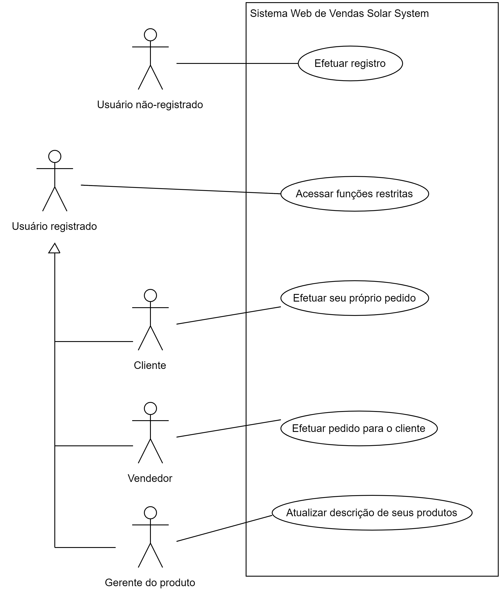

**Índice**

- [1. Introdução](#1-introdução)
- [2. Informações sobre a empresa](#2-informações-sobre-a-empresa)
- [3. Escopo do projeto](#3-escopo-do-projeto)
- [4. Interessados](#4-interessados)
- [5. Objetivos funcionais](#5-objetivos-funcionais)
- [6. Objetivos não-funcionais](#6-objetivos-não-funcionais)
- [7. COTS (Commercial Off-The-Shelf)](#7-cots-commercial-off-the-shelf)
- [8. Casos de uso](#8-casos-de-uso)
  - [8.1. Acessar funções restritas](#81-acessar-funções-restritas)
  - [8.2. Efetuar registro](#82-efetuar-registro)
  - [8.3. Efetuar seu próprio pedido](#83-efetuar-seu-próprio-pedido)
  - [8.4. Efetuar pedido para o cliente](#84-efetuar-pedido-para-o-cliente)
- [9. Wireframes](#9-wireframes)
- [10. Diagrama de classes de domínio](#10-diagrama-de-classes-de-domínio)

> Observação do professor: Este documento é um exemplo de parte de uma especificação de software. Não está com todos os detalhes necessários para iniciar o desenvolvimento de um software, mas serve de template para que cada grupo inicie a redação do documento do seu projeto.

> É uma adaptação, mas não uma tradução exata, de um [exemplo disponível na Universidade de Ohio](http://web.cse.ohio-state.edu/~bair.41/616/Project/Example_Document/Req_Doc_Example.html).

# 1. Introdução

Por via desse documento será apresentado os requisitos da empresa, tem como objetivo recomendar e conectar pessoas que tem gostos similares para livros, séries, para conectar pessoas e principalmente divulgar o meio de entretenimento. As pessoas poderão recomendar um desses meios de entretenimento, isso irá facilitar a popularização do mesmo.

A plataforma conta com Grande diversidade, isso irá causar uma movimentação onde cada vez mais irá mostrar meios do interesse do usuário, e até mesmo por conta do vasto catálogo irá recomendar sempre coisas novas.

Os usuários contaram com um suporte sempre que preciso para eventuais falhas isso trará um maio conforto a sua experiência e satisfação.

# 2. Informações sobre a empresa

A empresa está com esse projeto inovador de conectar as pessoas através de seus gostos para literatura e a sétima arte, apresentando talvez até uma conexão maior.

Compartilhar com outras pessoas seus gostos, irá e sempre trará recomendações novas, e cada vez mais que seus posts forem mais recomendados isso irá trazer cada vez mais novas recomendações para o usuário e ele sempre terá informações novas.

A empresa tem como finalidade conectar as pessoas através de seus gostos e de divulgar entretenimento,  fazendo com que sua divulgação cresça cada vez mais.

# 3. Escopo do projeto

Em seu escopo, o aplicativo é uma rede social, onde as pessoas são ligadas por suas recomendações e gostos, quem fará a parte de cadastro será o próprio usuário onde ele monta sua própria lista de indicação.
O site contará com a proteção dos dados pessoais dos usuários, além de manter a integridade com ele, o usuário tem seus dados protegidos com senhas e também pela segurança da própria empresa.

# 4. Interessados

Os beneficiados serão todos os usuários e as produtoras de filmes, livros e séries:

Usuários: irão cada vez mais ter itens de entretenimento para adicionar na sua lista, e poderão se conectar com pessoas com os mesmos interesses.

Produtoras(Filmes, livros e séries): terão seus produtos sendo divulgados, isso aumentará seu consumo e sempre terá novos clientes.

# 5. Objetivos funcionais

1.	No momento do registro, o usuário deverá fornecer os seguintes dados: nome completo, username que deseja utilizar, senha que usará para acessar o sistema, data de nascimento, cidade e estado.
2.	Cada membro poderá, a qualquer momento, atualizar os dados do seu perfil.
3.	Para entrar uma avaliação, o membro seleciona o tipo de item (livro, filme ou série), busca pelo nome do item, atribui uma nota de 0 a 10 (somente valores inteiros) e escreve os comentários que julgar relevantes (com limite de 1024 caracteres).
4.	O membro pode cadastrar um novo filme, série ou livro. Este novo item deve ser validado por um administrador de conteúdo antes de disponibilizar aos demais membros. Caso o item sugerido já exista, o administrador indica o item e vincula a avaliação ao item já existente.
5.	Ao cadastrar um livro, é necessário fornecer as seguintes informações: título, autor(es), editora, país, ano de lançamento.
6.	Ao cadastrar um filme, é necessário fornecer as seguintes informações: título, diretor, elenco principal, país, ano.
7.	Ao cadastrar uma série, é necessário fornecer as seguintes informações: título, diretor, elenco principal, país, ano, número de temporadas.
8.	 Cada membro terá uma página pessoal que listará todas as avaliações que ele já realizou. Os membros logados poderão pesquisar por outros membros pelo nome e acessar as suas páginas pessoais.
9.	Cada membro poderá propor relacionamento de amizade a outro membro. O relacionamento de amizade será estabelecido quando o outro membro aceitar a proposta.
10.	Os membros que possuem relacionamento de amizade podem adicionar comentários às avaliações feitas pelo outro.
11.	 Um membro poderá dar um "joinha" nas avaliações de outro membro. Em cada avaliação aparecerá o número de "joinhas" que ela já recebeu. O membro que deu o “joinha” para a avaliação poderá retirá-lo posteriormente se assim desejar.

# 6. Objetivos não-funcionais

1.	Qualquer pessoa da empresa pode se registrar nesta rede social.
2.	Após acessar o sistema, cada membro poderá avaliar os filmes, séries e livros que desejar
3.	Após o sistema ter pelo menos 10 membros cadastrados e cada membro entrar pelo menos 10 avaliações, o sistema passará a apresentar para cada membro recomendações de filmes, séries e livros que podem ser de seu interesse.
4.	O sistema deverá utilizar um algoritmo colaborativo para oferecer as recomendações a um determinado membro. Isto quer dizer que o sistema deverá identificar membros que têm um perfil semelhante com base nas avaliações já realizadas e oferecer recomendações com base no que estes membros avaliaram bem.
5.	A página pessoal de um membro mostrará, além das avaliações que ele fez, uma lista com os seus amigos e o número de ”joinhas” que já recebeu em suas avaliações.
6.	Quando um membro acessar a página de outro, o sistema deverá mostrar os amigos que eles têm em comum.
7.	Sempre que um membro acessar o sistema, ele deverá receber a sugestão de 3 membros que poderiam ser seus amigos. O critério será sugerir membros que têm preferências semelhantes, com base nas avaliações já realizadas.
8.	Cada filme, série e livro deverá ter uma página no sistema que reunirá todas as avaliações já realizadas daquele item, ordenadas pelo número de "joinhas" recebidas.
9.	O sistema deverá permitir que o gerente do serviço consulte:
1.	O número médio de amigos dos membros da rede social.
2.	Uma lista com os 10 membros mais conectados (com o maior número de amigos).
3.	Um gráfico mostrando a relação entre o número de amigos e o estado onde mora.

# 7. COTS (Commercial Off-The-Shelf)

Os softwares que serão adquiridos para compor o sistema são:

* Tradutor do português para o inglês e do português para o espanhol.

* Engine de pesquisa.

# 8. Casos de uso

A figura a seguir apresenta o diagrama de casos de uso:

## 8.1. Acessar funções restritas

**Nome do caso de uso:** Acessar funções restritas

**Resumo:** Para ganhar acesso a informações restritas ou personalizadas, fazer pedidos ou outras transações especializadas, um usuário precisa se autenticar e o sistema determinará seu nível de acesso.

**Pré-condições:**
* O usuário já se registrou.

**Pós-condições:**
* O usuário pode obter informações e realizar funções disponíveis para o seu nível de acesso.

**Fluxo principal:** 

1. O usuário seleciona a operação para efetuar o login.
2. O sistema solicita o seu *username* e a sua senha.
3. O usuário entra seu *username*  e sua senha.
4. O sistema verifica que o *username* e a senha correspondem às informações de um de seus usuários registrados.
5. O sistema inicia uma sessão e apresenta uma mensagem de boas-vindas baseada nas preferências do usuário.

**Fluxos alternativos:**

Passo 4:
* Se o *username* é invalido, o caso de uso retorna para o passo 2.

Passo 4:
* Se o *username* é válido e a senha é inválida, o sistema dá uma nova oportunidade para o usuário entrar a senha. Quando o usuário entra outra senha, o caso de uso continua com o passo 4, utilizando o *username* já informado e a nova senha.

## 8.2. Efetuar registro

> (em elaboração)

## 8.3. Efetuar seu próprio pedido

> (em elaboração)

## 8.4. Efetuar pedido para o cliente

> (em elaboração)

# 9. Wireframes

> (em elaboração)

# 10. Diagrama de classes de domínio

> (em elaboração)
